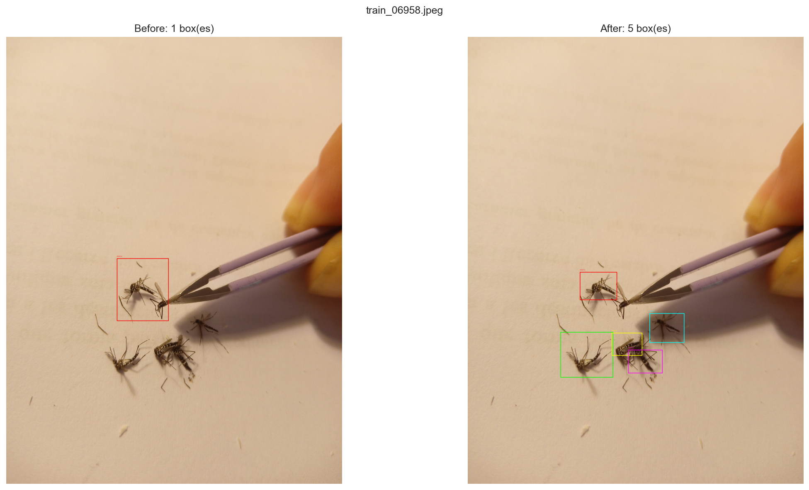

# Mosquito species classification (COMPSCI 760)

This repository includes coursework and tooling around **mosquito imagery**.

**Research question:** How effectively can deep learning models classify mosquito species from noisy, real-world images?

## Purpose of the study

Public-health and ecological monitoring often need to know **which mosquito species** are present in an area, because species differ in disease vector potential, habitat, and control options. Manual identification from field photos is slow and requires expertise.

This project addresses **automated species recognition from photographs**: given a labeled image dataset, we build detection and classification models that support mosquito species prediction from real-world images. The goal is to explore **deep learning with imbalanced classes and noisy image conditions** so performance can be compared across model families and pipeline designs.

## Dataset (as used in the notebook)

- **Source layout (Kaggle):** images under `images/images`, labels in `labels/annotations.csv` (see the `dataset_dir` path inside the notebook; adjust if you run locally).
- **Annotations:** CSV columns include image filename, image dimensions, bounding-box coordinates (`bbx_*`), and `class_label`. For modeling, the notebook collapses to **one row per image** by taking the **modal** `class_label` when multiple rows exist for the same file.
- **Manual labeling process:** before modeling, we performed sanity checks on the manual annotations and clarified ambiguous bounding-box labels. This included reviewing whether boxes correctly enclosed the mosquito, checking label consistency across repeated annotations, and cleaning unclear cases so the image-level species labels used for classification were more reliable.



- **Scale:** on the order of **~10k unique images** in the captured run, with **six species** (example class names in the notebook: *aegypti*, *albopictus*, *anopheles*, *culex*, *culiseta*, *japonicus-koreicus*). Counts are **highly imbalanced** (a few dominant classes and long-tailed rare classes).

This project is designed with 3 experiment testing phases.

## Experiment design

### Experiment A: Detection

This experiment uses the RF-DETR model to detect mosquitoes inside images. It contributes the first layer of the two-stage detection and classification pipeline by localizing mosquito regions before species classification.

To run the RF-DETR experiment, use the detection branch and follow the training/testing script in that branch:

```bash
git checkout detection/rf-detr-small-training-testing
```

The detection workflow trains RF-DETR on bounding-box annotations, evaluates predicted boxes, and exports detection outputs that can be passed into the downstream classification stage.

### Experiment B: Fine-grained classification

This experiment compares CNN-based and vision transformer approaches for mosquito species classification. The CNN candidates are EfficientNet-B0, ResNet50, and MobileNetV2. The vision transformer candidates are DeiT and ViT.

The classification experiments are run in Kaggle Notebook or Jupyter Notebook. To address class imbalance, we combine loss-management strategies and sampling methods, including:

- `weighted_sampler`
- `weighted_loss`
- `pf_loss`
- `stratified_sampling`
- combinations of the above methods

We apply hierarchical training to avoid a greedy full search over every model and method combination. First, candidate models and imbalance-handling combinations are trained for 5 epochs. We then examine gradient convergence behavior and validation results, select the top 3 candidates, and retrain them for more epochs with an early-stopping process.

### Experiment C: End-to-end vs two-stage comparison

This experiment compares labels predicted by end-to-end classification models with fine-grained classification outputs from the two-stage pipeline. The goal is to evaluate whether explicit mosquito detection before classification improves species recognition under noisy real-world image conditions.

## Preprocessing

- **Split:** stratified train / validation / test (e.g. 70% / 15% / 15% with a fixed `random_state` for reproducibility).
- **Input pipeline:** resize to 224×224, ImageNet normalization; light **data augmentation** on the training set (flips, small rotation, color jitter).
- **Class imbalance:** imbalance-handling methods include weighted sampling, weighted loss, stratified sampling, and probability-fairness style losses so minority classes are represented more reliably during training.
- **Training:** models use pretrained backbones where applicable, small learning rates, checkpointing, and best-model selection based on validation performance.

## Evaluation

- **Detection:** IoU and mAP are used to evaluate bounding-box localization and detection quality.
- **Classification:** macro-F1 is the primary metric because the dataset is class-imbalanced; balanced accuracy is the secondary metric to measure per-class recall fairness.

## Related code in this repo

The repository follows a naming convention based on `type-of-experiment/type-of-function`. For example, detection work is organized under detection-focused branches and files, while fine-grained classification work is organized under classification-focused branches and files. This keeps object detection, baseline classification, imbalance handling, data preparation, and comparison experiments separated while still supporting the full two-stage pipeline.

## Team contributions

- Sophia
- Youmin
- Jinghao
- Duong

---

*If you reuse this README, update dataset paths, author list, and institutional wording to match your course submission.*
